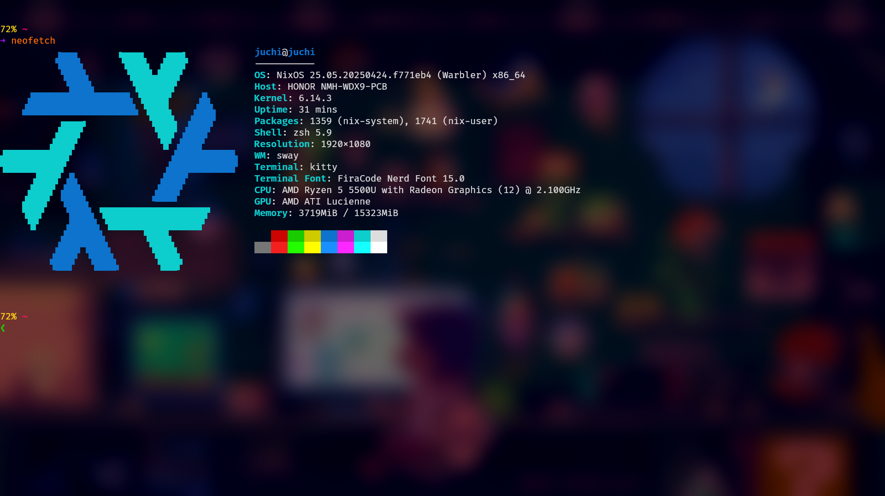
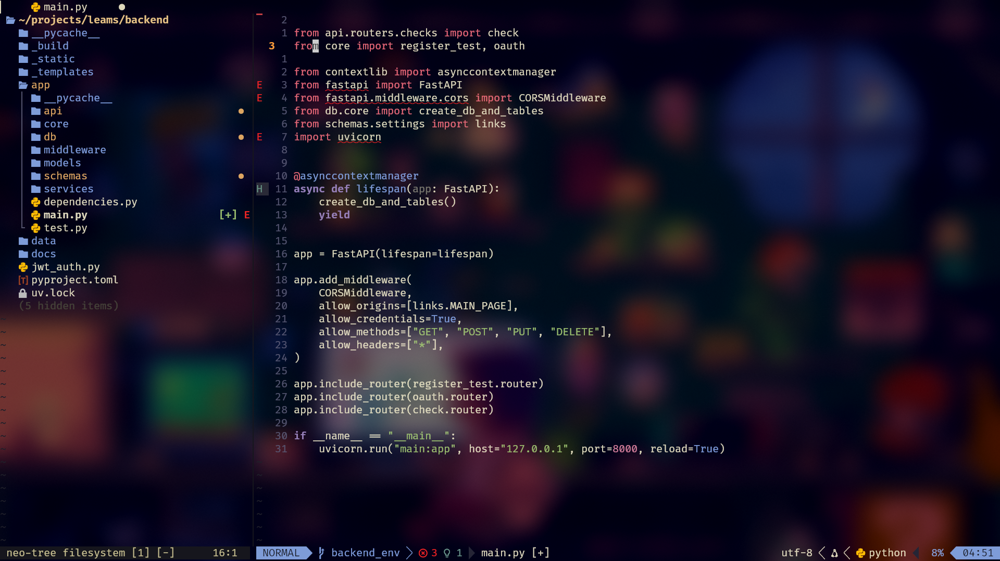

# Dotfiles: My NixOS Setup

Welcome to my final NixOS dotfiles!  
**Why final?** Because I'm moving on to [Gentoo](https://www.gentoo.org/) and [LFS (Linux From Scratch)](https://www.linuxfromscratch.org/).

> ⚠️ **Note:**  
> This configuration is tailored for [bspwm](https://github.com/baskerville/bspwm). So if you're hoping for fancy animations like [Hyprland](https://github.com/hyprwm/Hyprland) offers, you won’t find them here.

I had a great time configuring my system with [NixOS](https://nixos.org/)! Now, I'll be using NixOS exclusively as my main OS for VPS servers.  
Feel free to use or modify these configs for yourself—they might be just what you need. If you just want my terminal setup, check out my [Arch dotfiles](#) (written in lua and compatible with any OS, including NixOS and [nixvim](https://nix-community.github.io/nixvim/plugins/emmet/index.html)).

---

## 💻 Screenshots of my setup
  
  
  

---

## 📚 Useful NixOS Links

- [mynixos](https://mynixos.com/)
- [nixwiki](https://nixos.wiki/wiki)
- [home-manager](https://nix-community.github.io/home-manager/)
- [Nixos RU Telegram](https://t.me/ru_nixos)

---
